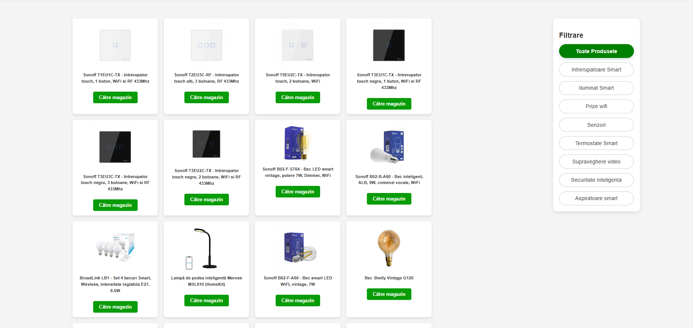

# Pagina-Produse – Smart Home Catalog


---
## Live Demo

[Click aici pentru demo live] (https://pagina-produse.vercel.app/)

---
## 🌟 Descriere

**Pagina-Produse** este o aplicație React simplă și elegantă care afișează produse Smart Home organizate pe categorii. Utilizatorii pot filtra produsele după categorie și pot accesa direct link-ul către magazinul online.  

Proiectul este modular, responsive și ușor de extins cu produse noi sau categorii suplimentare.

---

## 🛠 Funcționalități principale
- Filtrare produse după categorie
- Afișarea produselor cu imagine, denumire și link către magazin
- Design responsiv și hover efecte interactive
- Structură modulară și ușor de întreținut
- Poate fi extins rapid cu noi categorii și produse

---

## 🚀 Tech Stack
- **ReactJS** – pentru construirea UI-ului
- **JavaScript (ES6)** – logica aplicației
- **CSS personalizat** – design curat și responsive
- **React State (useState)** – filtrare produse pe categorii

---

## 🎯 Bonus / Extra Features
- Componentizare ușoară pentru adăugarea de funcționalități viitoare (ex: sortare, căutare)

---

## Screenshots / Demo GIF



---

## Notes

- Toate datele sunt locale, stocate în productData.js
- Design-ul și CSS-ul sunt păstrate fidel, cu efecte plăcute și responsivitate
- Aplicația poate fi extinsă rapid cu noi categorii, produse sau funcționalități

---

## 🔧 Skills Demonstrated

- Crearea unui UI modular și responsive cu React
- Gestionarea stării și filtrarea datelor în React
- Utilizarea CSS personalizat pentru layout și efecte vizuale
- Organizarea și documentarea proiectului pentru portofoliu

---

## Contact

- Email: agapiandreea53@gmail.com
- LinkedIn: https://www.linkedin.com/in/andreea-agapi-015705216/
- GitHub: [andreeaagai](https://github.com/andreeaagai)

---

## Installation / Setup

1. Clonează repository-ul:

```bash
git clone https://github.com/andreeaagai/Pagina-Produse.git

